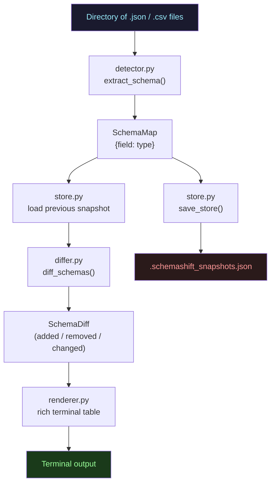

# 🔀 schemashift

> Detect schema drift in JSON and CSV data files — field by field, type by type, run after run.

**Scheduled and generated by [hellohaven.ai](https://hellohaven.ai)**

---

## Why It Exists

Data pipelines break silently. A vendor adds a field. A backend renames a column. A type changes from `int` to `string`. By the time someone notices, downstream systems have already ingested bad data.

`schemashift` watches your data files and tells you *exactly* what changed between runs — which fields were added, removed, or had their type flip. It’s a lightweight, local-first sentinel that needs no database, no cloud, and no instrumentation.

---

## Features

- 📂 **Watches directories** of `.json` and `.csv` files
- 🧠 **Infers field types** from actual values (int, float, bool, string, object, array, null)
- 🔍 **Diffs schemas** between runs: added / removed / type-changed fields
- 💾 **Persists snapshots** locally in `.schemashift_snapshots.json`
- 🖥️ **Rich terminal output** — color-coded tables with before/after types
- ⏱️ **Watch mode** — polls on a configurable interval
- 🔄 **Reset command** — wipe snapshots and start fresh

---

## Architecture



---

## How It Works

1. **Scan** — walks a directory for `.json` and `.csv` files
2. **Detect** — reads up to 50 rows per file and infers field types from values
3. **Compare** — diffs the live schema against the stored snapshot for each file
4. **Report** — renders a color-coded diff table per changed file
5. **Persist** — saves the new snapshot to `.schemashift_snapshots.json`

On the **first run**, everything is "new" (no baseline). On subsequent runs, only drift is highlighted.

---

## Setup

### Requirements

- Python 3.11+

### Install

```bash
git clone https://github.com/DucChau/schemashift
cd schemashift
python -m venv .venv && source .venv/bin/activate
pip install -e .
```

---

## Run

### Scan once

```bash
schemashift scan ./examples
```

### Watch continuously (every 10s)

```bash
schemashift watch ./examples --interval 10
```

### Show all fields (including unchanged)

```bash
schemashift scan ./examples --all
```

### Reset snapshots

```bash
schemashift reset ./examples
```

### All commands

| Command | Description |
|---------|-------------|
| `schemashift scan <dir>` | One-time scan + diff |
| `schemashift watch <dir>` | Continuous polling |
| `schemashift reset <dir>` | Clear snapshot store |

| Option | Default | Description |
|--------|---------|-------------|
| `--interval N` | `10` | Poll interval in seconds (watch only) |
| `--store <path>` | `<dir>/.schemashift_snapshots.json` | Custom snapshot file location |
| `--all` | off | Show unchanged fields too |

---

## Example Output

```
────────────────── Schema Shift Report ──────────────────
  3 file(s) scanned  •  2 with drift  •  1 clean

╭──────────────────── users_v2.json  +2 added  -1 removed  ~0 changed ────────────────────╮
│ Status     │ Field    │ Before  │ After   │
│ + ADDED    │ role     │ —       │ string  │
│ + ADDED    │ score    │ —       │ float   │
│ - REMOVED  │ age      │ int     │ —       │
╰───────────────────────────────────────────────────────────────────────────────╯

╭───────────── products_v2.csv  +2 added  -0 removed  ~1 changed ─────────────────────╮
│ Status     │ Field        │ Before  │ After   │
│ + ADDED    │ warehouse_id │ —       │ string  │
│ ~ CHANGED  │ price        │ float   │ string  │
╰───────────────────────────────────────────────────────────────────────────────╯

  ✓ products.csv — no schema changes
```

---

## Future Improvements

- [ ] Rename detection (field removed + field added with similar values = likely rename)
- [ ] JSON Schema / Avro / Parquet support
- [ ] GitHub Actions integration — fail CI when schema drift is detected
- [ ] Webhook alerts (Slack / email) on drift detection
- [ ] HTML report export
- [ ] `--since <date>` flag to compare against a historical snapshot

---

## License

MIT
